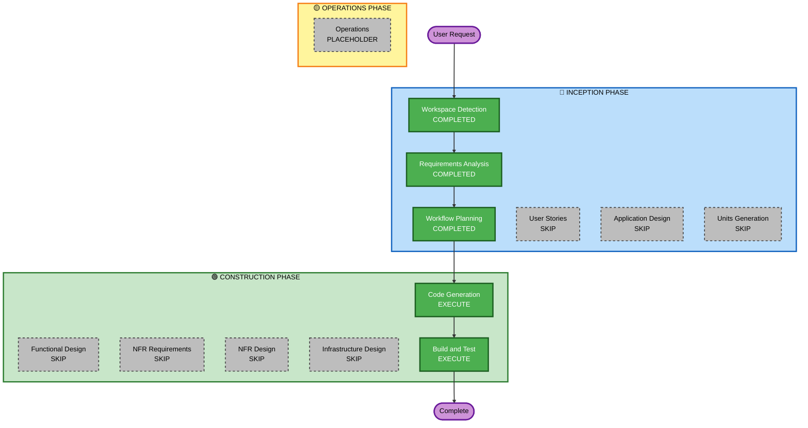

# Execution Plan — Cycle 4: bottle.png Sprite Integration

## Detailed Analysis Summary

### Transformation Scope
- **Transformation Type**: Single component — visual layer restructuring
- **Primary Changes**: Replace Graphics-drawn bottle outline with `Sprite` using `bottle.png`. Add a front layer (`worldFront: Graphics`) so hose, capper, and UI elements render in front of the bottle sprite.
- **Related Components**: `GameScreen.ts` only

### Change Impact Assessment
- **User-facing changes**: Yes — bottle now shows as a real image (semi-transparent amber glass)
- **Structural changes**: Minor — adds a second Graphics layer (`worldFront`) between bottle sprite and hitSurface
- **Data model changes**: No
- **API changes**: No
- **NFR impact**: No — one additional Graphics clear/redraw per frame, negligible

### Risk Assessment
- **Risk Level**: Low
- **Rollback Complexity**: Easy — single file change
- **Testing Complexity**: Simple — visual verification in browser

## Workflow Visualization



## Phases to Execute

### 🔵 INCEPTION PHASE
- [x] Workspace Detection (COMPLETED)
- [x] Reverse Engineering (SKIPPED — CLAUDE.md + prior cycles cover architecture)
- [x] Requirements Analysis (COMPLETED — minimal depth)
- [x] User Stories (SKIPPED — no new user interactions, single visual change)
- [x] Workflow Planning (COMPLETED — this document)
- [ ] Application Design — SKIP
  - **Rationale**: No new components. `bottleContainer` hierarchy defined in implementation-plan.md. This cycle adds only `bottleSprite + worldFront` to existing GameScreen.
- [ ] Units Generation — SKIP
  - **Rationale**: Single unit: GameScreen.ts

### 🟢 CONSTRUCTION PHASE
- [ ] Functional Design — SKIP
  - **Rationale**: No new business logic. Pure visual layer replacement.
- [ ] NFR Requirements — SKIP
  - **Rationale**: PoC. No performance/security concerns for a sprite swap.
- [ ] NFR Design — SKIP
- [ ] Infrastructure Design — SKIP
- [x] Code Generation — COMPLETED
  - **Rationale**: Implementation required.
- [x] Build and Test — COMPLETED
  - **Rationale**: Build verification + browser visual check.

### 🟡 OPERATIONS PHASE
- [ ] Operations — PLACEHOLDER

## Code Generation Plan (Part 1)

### File to modify: `src/app/screens/game/GameScreen.ts`

**Step 1** — Change `assetBundles` to load the `game` bundle:
```typescript
public static assetBundles: string[] = ['game'];
```

**Step 2** — Add `Sprite` and `Texture` to pixi.js imports.

**Step 3** — Add display object fields:
```typescript
private worldFront = new Graphics(); // front layer: hose, capper, UI
private bottleSprite = new Sprite();
```

**Step 4** — Reorder `addChild` in constructor to establish correct z-order:
```
bg → world (beer fill) → bottleSprite → worldFront → msgText, countText, instrText, fillZoneLabel, flowRateLabel → hitSurface
```

**Step 5** — In `show()`, set texture + anchor + scale once assets are loaded:
```typescript
this.bottleSprite.texture = Texture.from('bottle.png');
this.bottleSprite.anchor.set(0.5, 1);
this.bottleSprite.height = BOTTLE_H;
this.bottleSprite.scale.x = this.bottleSprite.scale.y; // maintain aspect ratio
```

**Step 6** — Refactor `drawWorld()`:
- Clear both `world` (g) and `worldFront` (gf)
- `drawHoseHolder(gf)`, `drawBeerStream(gf)`, `drawHose(gf)`, `drawCapper(gf)`, `drawFlowIndicator(gf)` — all move to front layer
- `drawBottleFill(g)` — beer fill rect + foam in back layer
- `drawBottleFront(gf)` — crown + gauge bar in front layer
- `updateBottleSprite()` — update sprite position each frame

**Step 7** — Split `drawBottle()` into two methods:
- `drawBottleFill(g: Graphics)`: only beer fill rect + foam ellipse
- `drawBottleFront(g: Graphics)`: crown (drawCrown) + fill gauge bar
- Remove the glass outline drawing (now the sprite)

**Step 8** — Add `updateBottleSprite()`:
```typescript
private updateBottleSprite(): void {
  this.bottleSprite.position.set(this.bottleX, this.BOTTLE_BOTTOM_Y);
}
```

## Success Criteria
- **Primary Goal**: `bottle.png` renders at the correct position, replacing the primitive green-outline glass
- **Key Deliverables**: Modified `GameScreen.ts` — bottle as Sprite, beer fill behind glass sprite
- **Quality Gates**: `npm run build` passes; bottle sprite visible in browser with fill showing through semi-transparent glass
